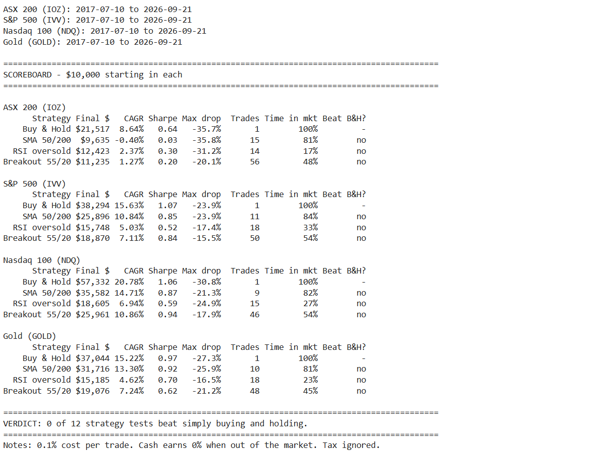
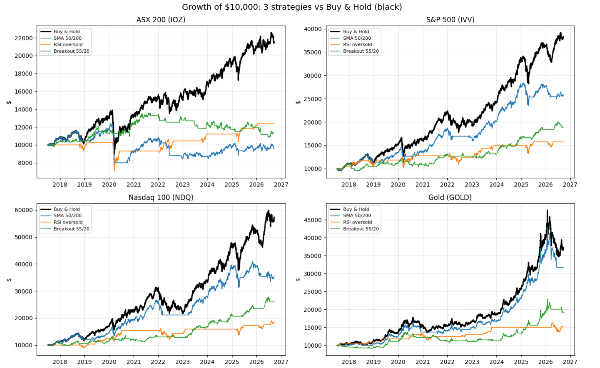
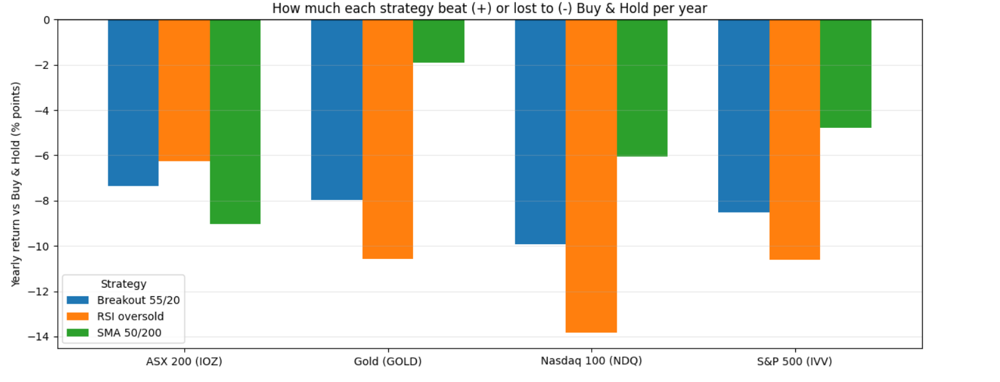
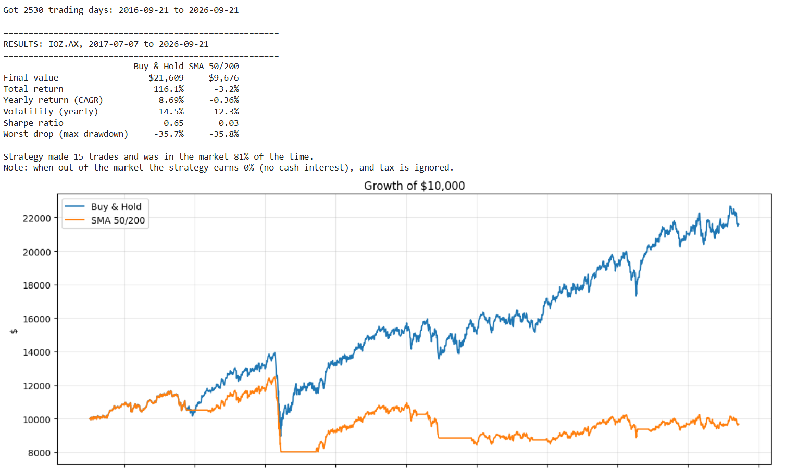
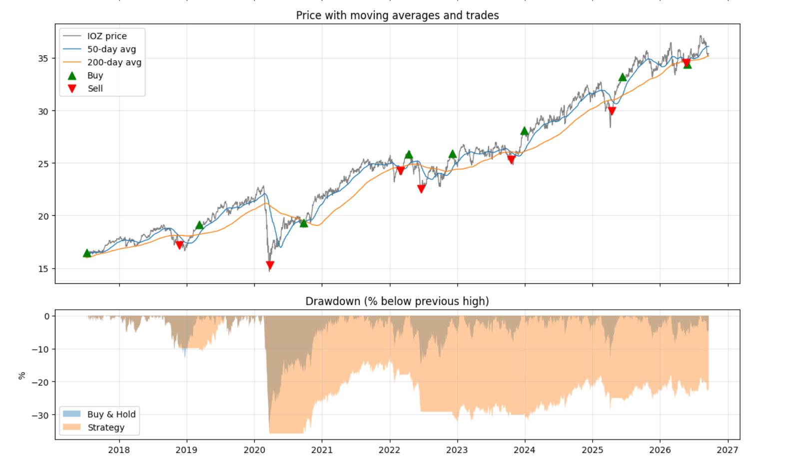
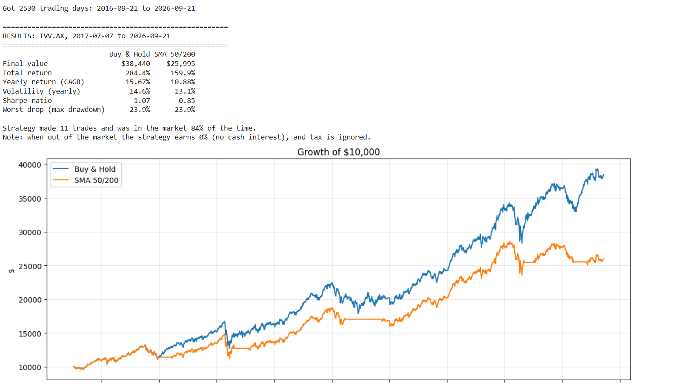
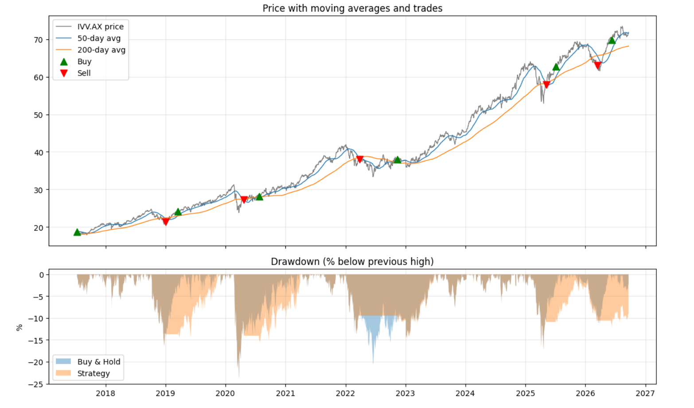

# Do Popular Trading Strategies Beat Buy-and-Hold?

Can a regular person make money trading with free data, well-known strategies and AI-assisted code? This project tests that honestly, with the rules fixed in advance and realistic trading costs.

**v2 (Strategy Showdown):** 3 popular strategies × 4 markets = 12 tests, July 2017 – September 2026

**v1:** deep dive on the 50/200 moving average crossover on the ASX 200 and S&P 500

## TL;DR

**0 of 12 strategy tests beat simply buying and holding**, on raw returns *or* on risk-adjusted returns (Sharpe ratio). Buy-and-hold had the best Sharpe ratio in all four markets.

---

# v2: Strategy Showdown

Script: `strategy_showdown.py`

## Strategies (standard textbook settings, locked in before running)

- **SMA 50/200 crossover** (trend following): hold when the 50-day average is above the 200-day average
- **RSI oversold** (mean reversion): buy when RSI(14) falls below 30, sell when it rises above 70
- **Breakout 55/20** (Turtle-style): buy when price closes above its previous 55-day high, sell when it closes below its previous 20-day low

## Markets (ASX-listed ETFs, priced in AUD)

ASX 200 (IOZ) · S&P 500 (IVV) · Nasdaq 100 (NDQ) · Gold (GOLD)

## Results: $10,000 starting in each

| Market | Buy & Hold | SMA 50/200 | RSI oversold | Breakout 55/20 |
|---|---|---|---|---|
| ASX 200 (IOZ) | **$21,517** (8.64%/yr) | $9,635 (−0.40%) | $12,423 (2.37%) | $11,235 (1.27%) |
| S&P 500 (IVV) | **$38,294** (15.63%/yr) | $25,896 (10.84%) | $15,748 (5.03%) | $18,870 (7.11%) |
| Nasdaq 100 (NDQ) | **$57,332** (20.78%/yr) | $35,582 (14.71%) | $18,605 (6.94%) | $25,961 (10.86%) |
| Gold (GOLD) | **$37,044** (15.22%/yr) | $31,716 (13.30%) | $15,185 (4.62%) | $19,076 (7.24%) |

| Market | Sharpe: Buy & Hold | Best strategy Sharpe |
|---|---|---|
| ASX 200 (IOZ) | **0.64** | 0.30 (RSI) |
| S&P 500 (IVV) | **1.07** | 0.85 (SMA) |
| Nasdaq 100 (NDQ) | **1.06** | 0.94 (Breakout) |
| Gold (GOLD) | **0.97** | 0.92 (SMA) |

## v2 Findings

**RSI oversold sat in cash most of the time.** It was only invested 17–33% of the time. It waits for a sharp fall to buy, then sells as soon as the market recovers, so in markets that mostly rise it missed most of the gains. It was the worst performer overall, trailing buy-and-hold on the Nasdaq by about 13.8 percentage points a year.

**Breakout traded the most and bled from it.** With 46–56 trades per market, costs and whipsaws (buying new highs, getting shaken out on small dips, buying back higher) steadily ate into returns.

**SMA 50/200 was the closest but still lost everywhere.** It reacted too late to fast crashes and fast recoveries. Its best result was gold, where it still trailed by about 1.9 points a year.

**Smaller drawdowns weren't a free lunch.** Several strategies had smaller worst drops than buy-and-hold (e.g. Breakout on the Nasdaq: −17.9% vs −30.8%). But that came mostly from sitting in cash about half the time. Holding part of your money in the ETF and part in cash gives a similar effect with no trading. The Sharpe ratio confirms it: once risk is accounted for, buy-and-hold still won in every market.

---

# v1: Moving Average Crossover Deep Dive

Scripts: `ioz_backtest.py`, `ivv_backtest.py`

| Market | Buy & Hold | SMA 50/200 Strategy | Gap |
|---|---|---|---|
| ASX 200 (IOZ) | $10k → **$21,609** | $10k → **$9,676** | −$11,933 |
| S&P 500 (IVV) | $10k → **$38,440** | $10k → **$25,995** | −$12,445 |

## Method (applies to v1 and v2)

- **Buy** when the 50-day moving average crosses above the 200-day moving average
- **Sell to cash** when the 50-day crosses back below the 200-day
- Trades are executed the **day after** the signal, to avoid look-ahead bias (you only know the signal after the market closes)
- A **0.1% cost** is charged on every buy and sell to cover brokerage and spread
- Prices are **dividend-adjusted**, so buy-and-hold gets credit for reinvested dividends
- All approaches start on the same date, after a 200-day warm-up period

## v1 Results

### ASX 200 (IOZ)

| Metric | Buy & Hold | SMA 50/200 |
|---|---|---|
| Final value | $21,609 | $9,676 |
| Total return | 116.1% | −3.2% |
| Yearly return (CAGR) | 8.69% | −0.36% |
| Volatility (yearly) | 14.5% | 12.3% |
| Sharpe ratio | 0.65 | 0.03 |
| Max drawdown | −35.7% | −35.8% |

15 trades, in the market 81% of the time.

### S&P 500 (IVV)

| Metric | Buy & Hold | SMA 50/200 |
|---|---|---|
| Final value | $38,440 | $25,995 |
| Total return | 284.4% | 159.9% |
| Yearly return (CAGR) | 15.67% | 10.88% |
| Volatility (yearly) | 14.6% | 13.1% |
| Sharpe ratio | 1.07 | 0.85 |
| Max drawdown | −23.9% | −23.9% |

11 trades, in the market 84% of the time.

## v1 Findings

**1. Fast crashes break the strategy.** In the March 2020 COVID crash, prices fell so quickly that the 50-day average didn't cross below the 200-day until the crash was nearly over. The strategy rode the full fall, sold near the bottom, then bought back only after the recovery. On IOZ this single event wiped out most of its gains, and it never caught up.

**2. Whipsaws add up.** In choppy markets (IOZ in 2022, IVV in 2025–2026), the strategy repeatedly sold after a dip and bought back higher once the market rebounded. Each round trip locked in a loss.

**3. It works in slow bear markets.** The one clear win was the S&P 500 in 2022. That decline was a slow grind rather than a crash, so the strategy exited early, capped its drawdown at about 10% while buy-and-hold fell about 20%, and re-entered near the same price.

**4. No crash protection when it mattered.** The worst drawdown was essentially identical to buy-and-hold in both markets (−35.8% vs −35.7% on IOZ, −23.9% vs −23.9% on IVV), so the strategy gave up returns without delivering the protection that is its main selling point.

**Takeaway:** a 50/200 crossover can help in slow, drawn-out declines, but it reacts too late to fast crashes and V-shaped recoveries. Recent markets have mostly featured the latter, so over this period, doing nothing beat trading.

## Limitations

- When out of the market the strategy earns 0%. Real cash would earn interest, which would help the strategies that sat in cash most (especially RSI), but it would not close gaps this large.
- Taxes are ignored. Frequent selling would likely make the strategy look *worse* after capital gains tax.
- IVV, NDQ and GOLD are priced in AUD, so their results include AUD/USD currency movements.
- Only standard, textbook settings were tested, on purpose. Tuning the averages until something "wins" on past data risks overfitting, where a strategy looks great historically but fails going forward.
- Past performance does not predict future results. This is a learning project, not financial advice.

## How to Run

1. Open [Google Colab](https://colab.research.google.com) and create a new notebook
2. Paste the contents of `strategy_showdown.py`, `ioz_backtest.py` or `ivv_backtest.py` into a cell
3. Run it. Data is downloaded automatically from Yahoo Finance, so no dataset upload is needed

Settings (markets, costs, averages) are at the top of each script.

## Tools

Python · pandas · NumPy · Matplotlib · yfinance · Google Colab

## Author

**Aaron Durom**, Bachelor of Business Analytics (Deakin University), currently studying a Master of Cyber Security.
